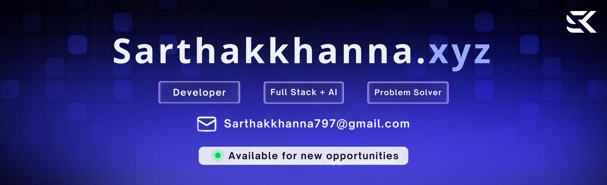

 
 

<h3>A passionate developer from India building real projects</h3>

- 🎓 Currently pursuing a degree in Computer Science and Engineering Batch '27

- 🔭 I'm currently working on [Release Note AI](https://releasenotesai.vercel.app/)

- 🌱 I’m currently learning **NextJS** by making projects in it

- 👨‍💻 All of my projects are available at [Sarthakkhanna07](https://github.com/Sarthakkhanna07)

- 💬 Ask me about **Next.js, React, javascript and AI Integrations**

- 📫 How to reach me **sarthakkhanna797@gmail.com**

 

  <b>⚡ I’ve always loved art, and my curiosity for technology led me to discover coding — a creative space where both worlds come together</b>

 

 &ensp; <b> Things I code with</b>
 

  
  
  
  
  
  
  
  
  
  
  
  
  
  
  
  
  
  
  
  
  
  
  
  
  
  
  
  
  

 

 &ensp;<b> Stats </b>

  

  

